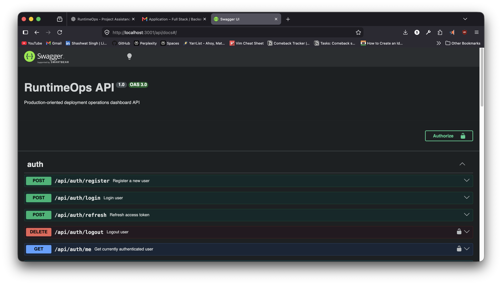

# RuntimeOps API

NestJS backend powering the RuntimeOps platform.

## Features

- JWT Authentication
- Refresh Token Rotation
- User Management
- Project CRUD
- Deployment Management
- Activity Tracking
- Metrics Dashboard APIs
- Health Monitoring
- Swagger Documentation

## Technology Stack

- NestJS
- PostgreSQL
- Prisma
- Redis
- BullMQ
- JWT
- Swagger

## Environment Variables

See `.env.example`.

## Database

Run seed data:

```bash
npx tsx prisma/seed.ts
```

## Swagger Documentation

Available at:

```text
http://localhost:3001/api/docs
```

### Swagger Preview



## Main Modules

- Auth Module
- User Module
- Projects Module
- Deployments Module
- Activities Module
- Metrics Module
- Health Module

## Deployment Lifecycle

```text
QUEUED
→ BUILDING
→ DEPLOYING
→ HEALTH_CHECK
→ SUCCESS
```