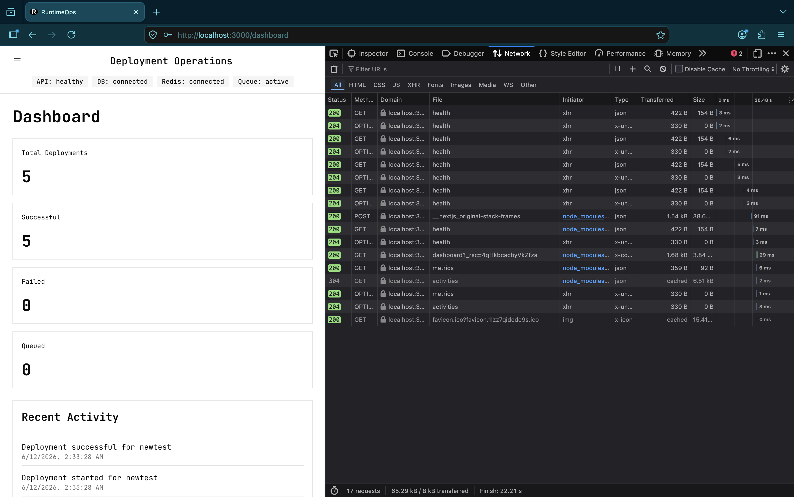

# RuntimeOps Frontend

Next.js frontend for RuntimeOps.

## Features

- Landing Page
- Login & Registration
- Dashboard Metrics
- Project Management
- Deployment Monitoring
- Activity Feed
- User Profile Management
- Responsive Design

## Technology Stack

- Next.js 15
- React 19
- TypeScript
- Tailwind CSS
- TanStack Query
- Axios

## Pages

```text
/
├── login
├── register
├── dashboard
│   ├── projects
│   ├── deployments
│   ├── activities
│   └── profile
```

## API Integration

The frontend communicates with the NestJS backend through REST APIs and uses TanStack Query for server state management.

## Responsive Design

RuntimeOps supports:

- Desktop
- Tablet
- Mobile

### Mobile Preview


